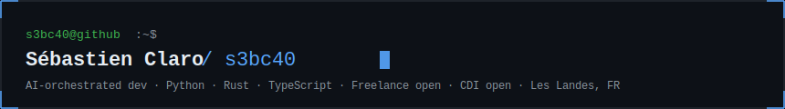

  

 

<!-- about -->

Full stack developer with 4 years of experience.
I build MVPs, CLI tools, and internal tools fast — using AI-orchestrated development with Claude Code.

I stay in the driver's seat on architecture and decisions. Claude Code handles the volume.

Available for **freelance missions** and **CDI opportunities** · Hybrid from Les Landes, FR

 

<!-- projects -->

## // projects

| Project | Description | Install |
|---|---|---|
| [**devbrief**](https://github.com/s3bc40/devbrief) | AI-powered human-readable brief for any GitHub repo · Python CLI | `uvx devbrief <github-url>` |
| [**txdecode**](https://github.com/s3bc40/txdecode) | Blazing fast EVM transaction decoder · Pure Rust CLI | `cargo install txdecode` |

 

<!-- stack -->

## // stack

`Python` `Rust` `TypeScript` `AWS` `Claude Code` `Docker` `Linux`

 

<!-- stats -->

## // stats

  
  &nbsp;&nbsp;
  

 

<!-- contact -->

## // contact

→ [s3bc40.com](https://www.s3bc40.com)
→ [linkedin.com/in/sgoncalvesclaro](https://www.linkedin.com/in/sgoncalvesclaro/)
→ [s3bc40@gmail.com](mailto:s3bc40@gmail.com)

Open to freelance contracts and CDI · Async-first · Responds within 24h
