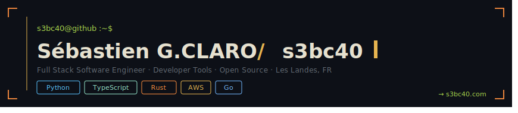

  

 

<!-- about -->

Full stack engineer with 4 years of experience, based in Les Landes, FR.

I take a problem, pick the right tool, and ship something that runs.
From infra to interface, without over-engineering.

Python and TypeScript are my main ground. I reach for Rust for system-level
performance, Go when the codebase requires it.

Open to **full time remote positions** · Les Landes, FR

 

<!-- projects -->

## // projects

| Project | Description | Install |
|---|---|---|
| [**devbrief**](https://github.com/s3bc40/devbrief) | Developer CLI for project situational awareness · Python · Rust bridge via PyO3 | `uv tool install devbrief` |
| [**txdecode**](https://github.com/s3bc40/txdecode) | EVM transaction decoder · Pure Rust CLI | `cargo install txdecode` |
| [**otomais-memory**](https://github.com/s3bc40/otomais-memory) | MCP server · Dofus encyclopedia via Django + FastMCP | |
| [**RoastDev**](https://github.com/s3bc40/roastdev) | Developer quiz app · Real-time multiplayer · React + Node + Socket.io | |
| [**kiji-proxy**](https://github.com/dataiku/kiji-proxy) | Open source contribution · Dataiku ML platform proxy · Go | |

 

<!-- stack -->

## // stack

 

<!-- stats -->

## // stats

  
  &nbsp;&nbsp;
  

 

<!-- contact -->

## // contact

→ [s3bc40.com](https://www.s3bc40.com)
→ [linkedin.com/in/sgoncalvesclaro](https://www.linkedin.com/in/sgoncalvesclaro/)
→ [s3bc40@gmail.com](mailto:s3bc40@gmail.com)

Open to full time remote positions · Async-first · Responds within 24h
